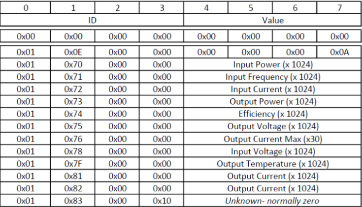
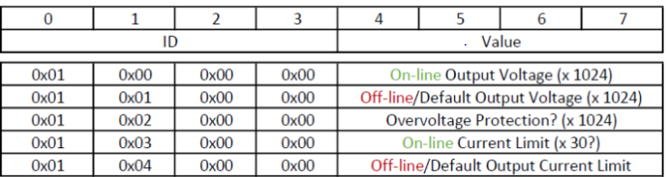

# ESP32-S3 CAN Power Supply Controller

This project uses the **ESP32-S3 DevKitC-1** to control the **RG4850G2** power supply via CAN communication. The physical CAN layer is handled by the **MCP2510** CAN controller.

## System Overview

- The **ESP32-S3 DevKitC-1** acts as the main microcontroller communicating with the power supply over the CAN (TWAI) protocol.
- Communication relies on the **MCP2510** CAN controller and a rotary encoder for adjusting settings.
- The encoder allows the user to adjust the output voltage and current limit.
- Adjusted values are packed and sent as CAN commands to the RG4850G2 power supply.
- The system enables precise and dynamic control of the power supply’s output parameters in real time.

## Detailed Code Explanation

For a detailed explanation of the code and its workings, please see this [PDF document](/Images/Esp32s3_ILI9341_LVGL_RG4850G2.pdf).

## Features

- Reading rotary encoder input for setting parameters.
- Packing voltage and current limit values into CAN message format.
- Sending CAN commands from the ESP32-S3 to control the power supply.
- Utilizing MCP2510 as the CAN physical layer for stable communication.

# RG4850G2 - CAN Communication Protocol

This section describes the communication protocol used to interface with the **RG4850G2** power supply via the **CAN Bus**. The protocol and command format are based on the implementation tested with custom hardware using LPC1768 microcontroller (the code was first written for this platform), but now we changed to the ESP32-S3 + MCP2510 setup.

---

## 📡 Requesting Device Parameters

To request operational parameters such as:

- Temperature  
- Input/Output Voltage  
- Input/Output Current  
- Power  
- Efficiency  
- Input Frequency  

send the following CAN frame:

- **Request ID**: `0x108040FE`  
- **Payload**: `00 00 00 00 00 00 00 00` (8 bytes zeroed)

The device will respond with multiple frames containing the requested parameters:

- **Response ID**: `0x1081407F`  
- **Payload**: Parameter data (format depends on firmware version)

Once the data transmission completes, an end-of-response frame is sent:

- **End Response ID**: `0x1081407E`

---

## ⚙️ Setting Configuration Values

You can configure operational settings by sending specific CAN commands. Below are some of the main commands used:

| Description                                       | Command (Hex)       |
|--------------------------------------------------|---------------------|
| Set Output Voltage (On-line)                     | `0x01000000`        |
| Set Output Voltage (Off-line)                    | `0x01010000`        |
| Set Overvoltage Protection Threshold             | `0x01020000`        |
| Set Current Limit (On-line)                      | `0x01030000`        |
| Set Default Current Limit (Off-line)             | `0x01040000`        |

Each command expects a payload containing the encoded value.

---

### Pictures & Site to the power supply

For more detailed information about the protocol, operation, and specifications of the RG4850G2 power supply, please visit the following link:

[Review and Protocol Details of Huawei R4850G2 Power Supply](https://www.beyondlogic.org/review-huawei-r4850g2-power-supply-53-5vdc-3kw/)

Protocol picture that can be find on a website:

  
  

---

